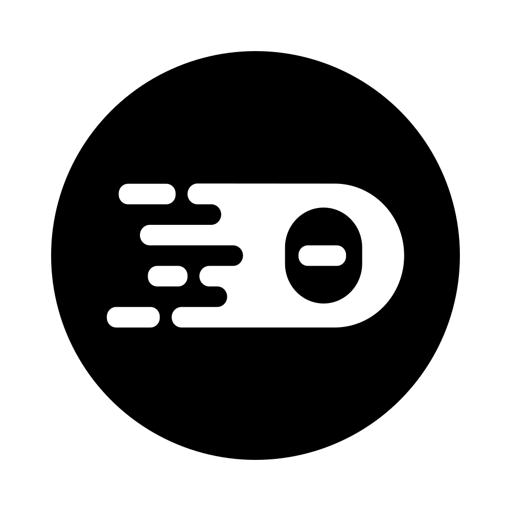

# PDE Studio 

<table>
<tr>
<td></td>
<td>Interact with code and data - Powered by Jupyter Lab</td>
</tr>
</table>

<table>
<tr>
<td></td>
<td>Develop using an integrated development environment - Powered by Theia</td>
</tr>
</table>

<table>
<tr>
<td></td>
<td>Start/Stop my PDE Studio</td>
</tr>
</table>